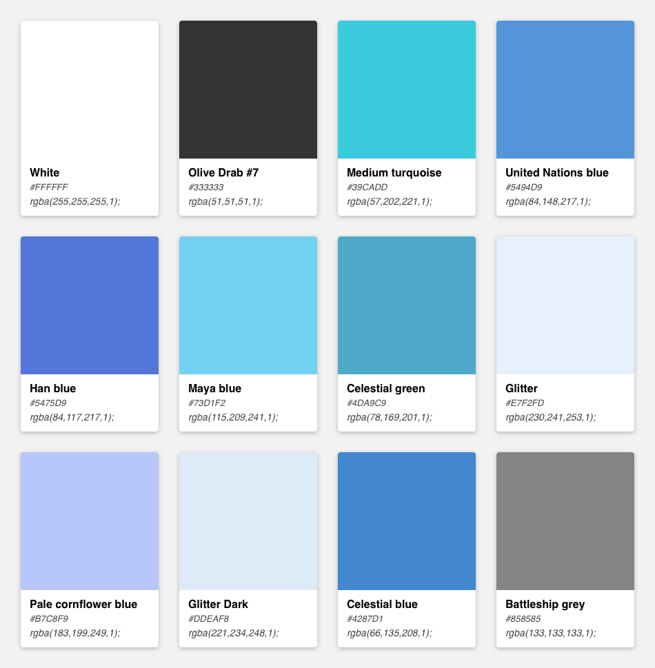
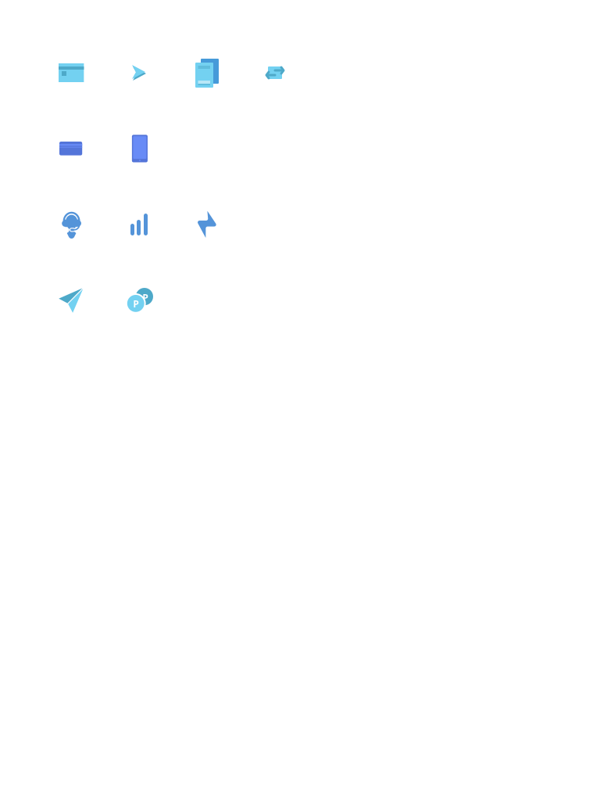
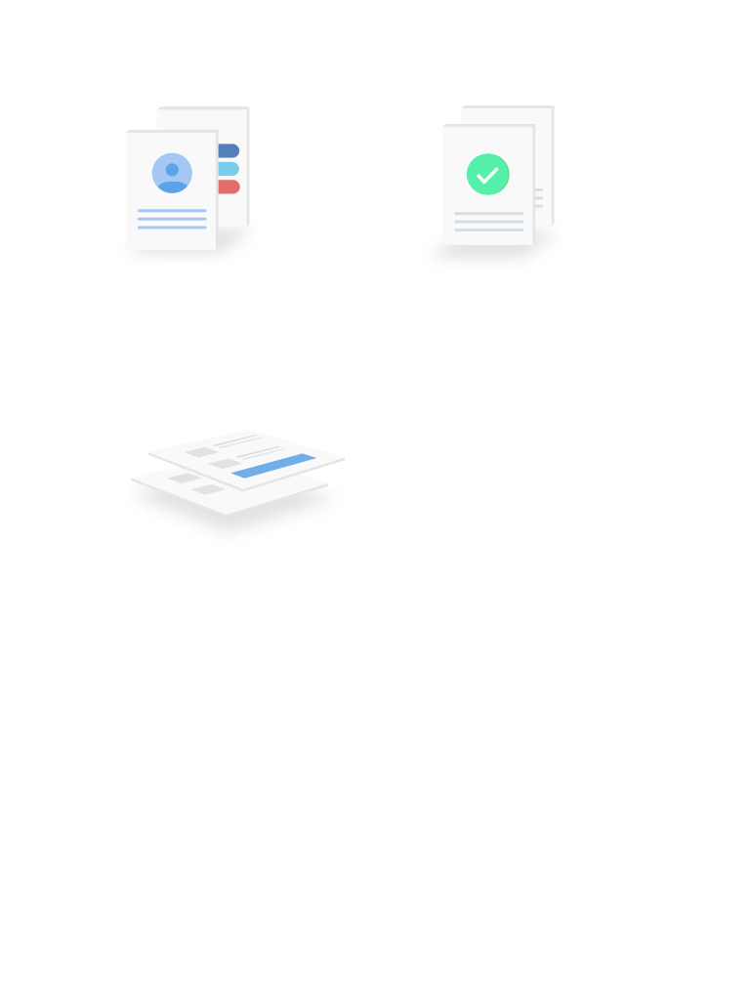
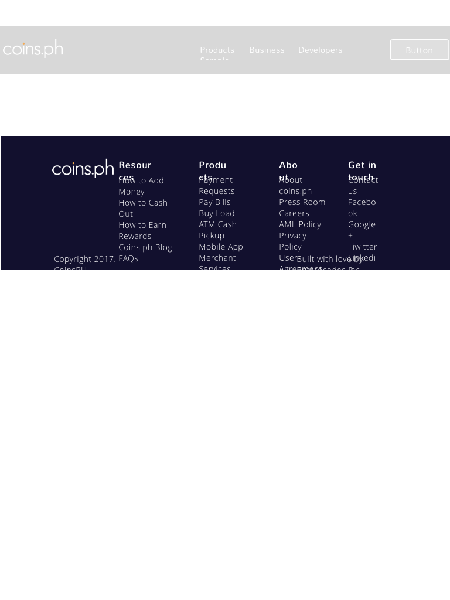

# Artboards

This is an autogenerated file showing all the artboards. Do not edit it directly.

## Accepting Payment Desktop

## Accepting Payment Mobile

## Business Page Desktop

## Business Page Mobile

## Footer

## Navigation

## Sending Payment Desktop

## Text Styles

## border 

## button 

## buttons

## card 

## circle 

## color 

## colors

## footer 

## icon 

## icons

## illus 

## illustrations

## logo

## modules

## navigation 

## state 

## utilities

